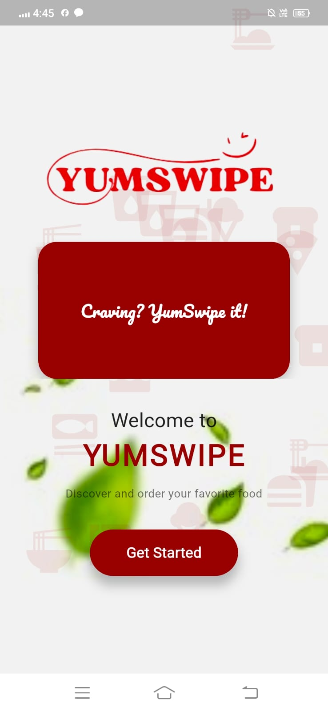
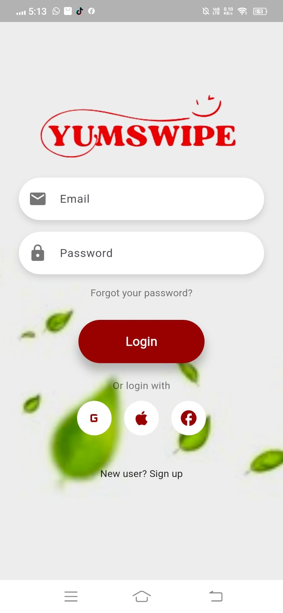
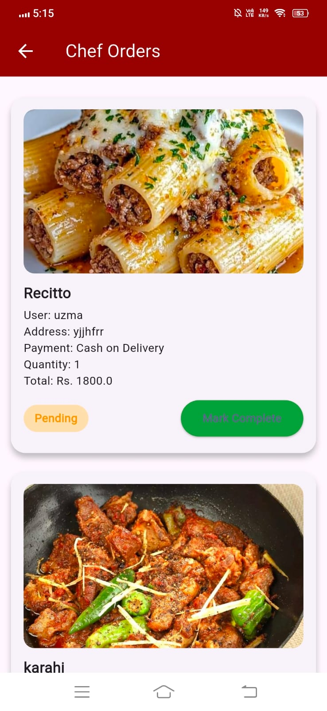
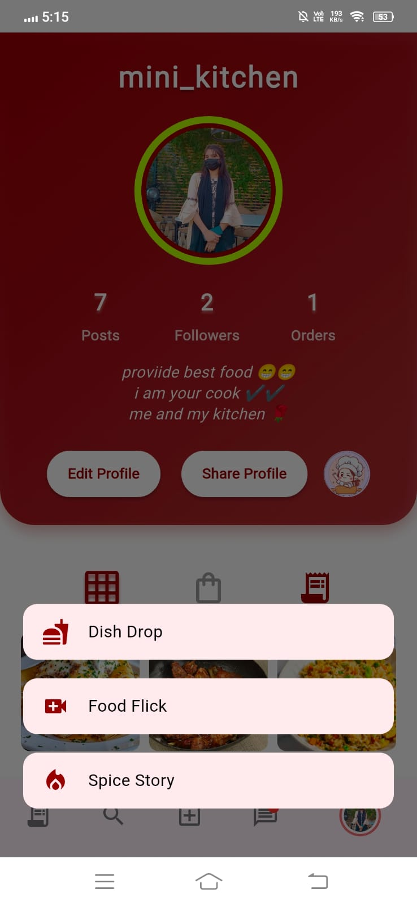

# flutter_application_1

A new Flutter project.

## Getting Started

This project is a starting point for a Flutter application.

A few resources to get you started if this is your first Flutter project:

- [Lab: Write your first Flutter app](https://docs.flutter.dev/get-started/codelab)
- [Cookbook: Useful Flutter samples](https://docs.flutter.dev/cookbook)

For help getting started with Flutter development, view the
[online documentation](https://docs.flutter.dev/), which offers tutorials,
samples, guidance on mobile development, and a full API reference.

# YumSwipe UI Mockups

This folder contains the UI mockups for the YumSwipe app. Click on the thumbnails to view the full-size image.

---

### Main Page

### Login Screen

### Signup Screen

### Cart Screen

### Chat List

### Chef Profile

### Order Status

### Uploads

